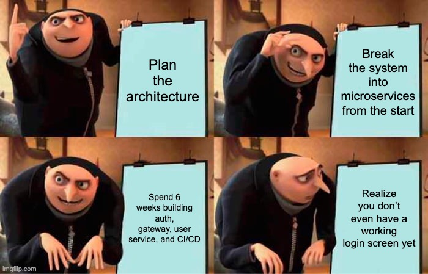
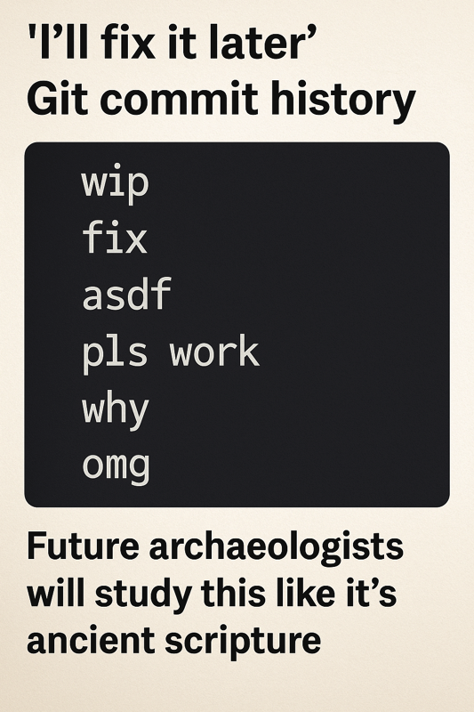
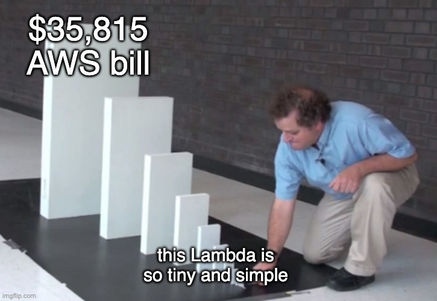
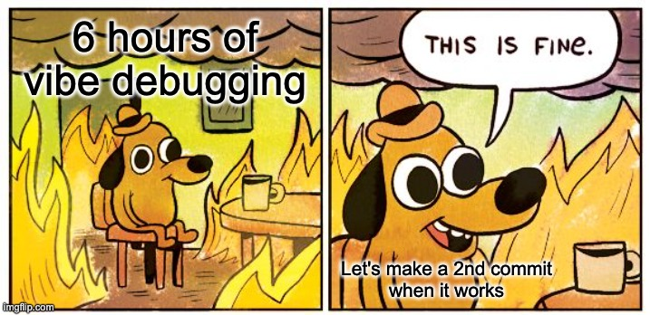

AI-assisted coding is here—like it or not. As large language models (LLMs) get better at writing and debugging code, we’re learning how to work alongside them. But contrary to what you might think, they don’t always mean *less* coding. In my case, it’s been the opposite.

Over the past few years, working as a software architect, I’ve been deeper in code than ever—reviewing, refining, and debugging LLM-generated output. The landscape is changing fast, and staying on top means getting your hands dirty.

I’ve seen people from marketing, finance, and other domains jump into coding with the help of AI. They get excited, build little tools, learn some Python—and sometimes even ship something useful. But that doesn’t make them software engineers, and they’re certainly not deploying systems at scale. Owning a gun and knowing how to shoot doesn’t make you a soldier.

LLMs let you build fast. You can bootstrap a prototype with minimal experience. But once the project grows beyond a handful of files, you're deep in vibe-debugging land—chasing hallucinations, losing context, and untangling obscure logic.

The tooling is improving—copilots, agents, longer context. But the farther you go without discipline, the more likely you’ll get stuck. This post isn’t about dismissing AI coding. It’s about building responsibly with LLMs—especially when you're leading the architecture.

Here are the principles that keep me sane while building with AI.

---

## 🧾 Start With Project Context

Before writing code, write a simple product brief. Save it as `README.md`, `project.md`, or `context.md`.

Include:

1. **Users and roles**
2. **Main use cases**
3. **Key integrations** (and their limits)
4. **Constraints** (budget, deadlines, infrastructure, etc.)

This doc isn't a spec. It’s a north star—reminding you (and your LLM) what problem you're solving.

---

## 🎨 Sketch Before You Paint

LLMs tend to overbuild. You'll get layers of exception handling, edge cases, and opinionated patterns—before you've even validated the basics.

Instead, start like an artist: create a rough sketch. Focus on structure, not polish. Ask your LLM for skeletons, not final drafts. You’ll move faster and stay in control.

---

## 🛠️ Use the Stack You Know

Vibecoding isn't just coding—it's mostly debugging. And when your LLM hits a wall, **you** have to step in.

Stick with stacks you know well. That cool new Rust framework might look fun, but if you're fluent in PHP or Django, you’ll save hours of review and rewrites.

Familiar tech also improves maintainability. LLMs and teammates are both more likely to understand Django than that hip new meta-framework.

---

## 🧱 Monolith First



Unless you're a Kubernetes expert, avoid microservices early on.

Start with a monolith. Keep it modular. You can always extract services later. Most modern frameworks support clean separation and will scale farther than you think.

Premature scaling kills momentum. Solve real problems, not hypothetical ones.

---

## 🔍 Stay in Control

Let’s be honest—code review isn’t fun. But LLM-driven development turns your entire process into one long code review.

Read everything. Don’t blindly trust completions. LLMs hallucinate. They forget context. They make confident mistakes.

Break work into chunks. Review as you go. Commit when things are stable. Repeat.

---

## 💾 Commit With Discipline



- Make atomic commits
- Write concise, helpful messages
- Don’t hoard changes—or spam commits
- Avoid messy branching unless necessary

Assume anything you're working on could be thrown away tomorrow. Keep your history clean.

---

## 🚀 Deploy Day One


Get something live on day one. Even a simple “Hello World” forces you to validate assumptions about infrastructure, runtime, and stack choices.

Avoid jumping into serverless too early. Vercel, Lambda, and similar platforms are convenient—but they can be costly traps if misused. I’ve seen projects rack up five-figure bills after a viral spike.

Instead, default to:

- **Docker**
- **Open-source database**
- **Simple VM or container host**

This setup gives you freedom to scale, migrate, or bail when needed.

---

## 🧠 Conclusion



Vibecoding is powerful—but only if you stay in the driver's seat. AI won’t replace engineers who understand systems, constraints, and users. But it *will* supercharge the ones who do.

As architects, we don’t just write code. We set direction, manage trade-offs, and take responsibility. LLMs don’t take that away—they make it even more important.

Use the tools. But don’t vibe your architecture into chaos.

---

## 📎 Bonus: PRD Template

```
# Vibecode – Product Requirements Document (PRD)

**Author:** Oleksiy Zelenyuk  
**Date:** 2025-05-30  
**Version:** 0.1  
**Status:** Draft

---

## 🧭 Purpose

Vibecode is a lightweight AI-assisted coding workflow tailored for software architects and senior engineers. It helps prototype and deliver clean, maintainable systems using LLMs, without losing control over architecture, tech stack, and deployments.

---

## 👥 Target Users

- **Software Architects** – care about design and maintainability  
- **Senior Developers** – use AI but want more structure  
- **Tech Leads / CTOs** – need consistency in AI workflows  
- **AI-curious non-devs** – experimenters needing guardrails

---

## 🧩 Key Features

- **Project Context Generator** – roles, goals, constraints in Markdown  
- **Sketch-First Prompts** – focus on structure before logic  
- **Stack Guardrails** – stick to familiar, maintainable tech  
- **Monolith-First Templates** – MVP-friendly, modular-ready codebases  
- **Commit Coach** – guides atomic, well-labeled Git commits  
- **Deployment Bootstrap** – Docker + open DB, serverless warnings

---

## 🧪 Success Metrics

- ⏱ MVP in < 2 hours  
- 🔁 60%+ returning users in 30 days  
- 🪲 75%+ bugs caught during review  
- 🧱 90%+ complete MVP in original stack

---

## 📦 Requirements

**Functional:**  
- Context markdown  
- Prompt templates  
- Git & LLM integration  
- Docker deploy script

**Non-Functional:**  
- CLI or lightweight UI  
- Offline/local LLM support  
- Minimal telemetry (opt-in)

---

## 🚧 Risks & Constraints

| Risk                         | Mitigation                         |
|-----------------------------|-------------------------------------|
| LLM hallucinations           | Review-first workflow               |
| Stack misuse                 | Strong defaults + warnings          |
| Lock-in to serverless        | Docker-first deploy strategy        |

---

## 📅 Timeline

- ✅ **May** – Concept & blog post  
- 🔨 **Jun–Jul** – MVP build  
- 🧪 **Aug** – Alpha testing  
- 🚀 **Sep** – Public beta

---

## ❓Open Questions

- CLI, VS Code extension, or Web UI?  
- Which LLMs to support (OpenAI, local)?  
- Community stack templates?  
```
